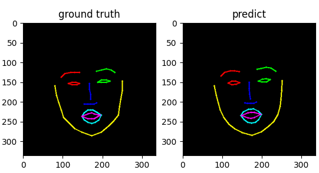

#### update

- 2023.4.28 完成cvae数据加载部分的编写
- 2023.4.29 完成head_pose cvae的编写并跑通
- 2023.5.05 完成将head_pose的cvae融入到audio2landmark中并进行训练
- 2023.5.08 开始将face_recon中投影到平面上的几千个vex的loss嵌入到image2image上
- 2023.5.08 完成将face_recon中投影到平面上的几千个vex的loss嵌入到image2image上, 并基于这个来计算loss


#### generate datasets
```
python video_analysis_and_data_generation.py
```

#### Run

train audio2landmark
```
python models/train_audio2landmark.py
```

test audio2landmark
```
python models/eval_audio2landmark.py
```



train audio2landmark
```
python models/train_landmark2face_LIA.py
```

test audio2landmark
```
python models/train_landmark2face_LIA.py --phrase test
```


#### 技术总结
```
当前的audio2landmark使用了两个模块，一个Audio2landmark_content和一个Audio2landmark_speaker_aware。
一个针对是content一个是针对说话的人的emb的。
但是content的分支应该是一厢情愿, 并没有什么显示的规则来约束, 要说有约束那就是因为Audio2landmark_speaker_aware中确实有emb的输入
emb是通过一个AutoVC的预训练模型得到, 这样等于是在audio中增强了属于speaker的信息, 虽然是这样也不能说content中就没有id emb的信息了

就是content中有很大的可能还耦合着id emb中的信息, 没有解耦开来

content: 对标的应该是表情和口型
id emb: 对标的应该是head pose和人脸面部的轮廓五官的位置

但是五官主要是通过第一帧的图片来控制, head pose也是无法与音频进行强相关的(单训练一个人一段视频应该是ok的, 但是在别的场景进行推理泛化性就会极差)
```


